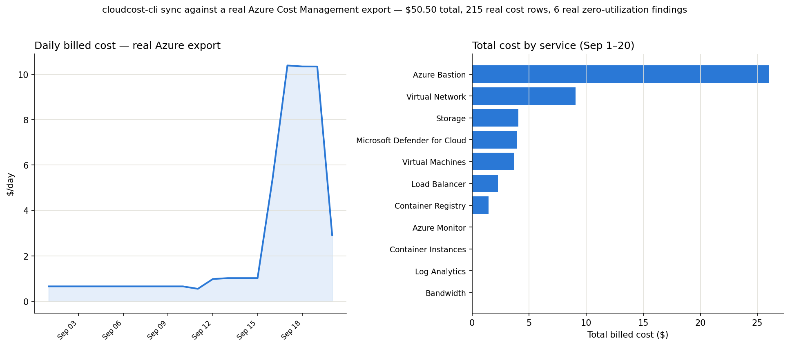

# CloudCost CLI

**Enterprise Multi-Cloud FinOps Data Platform**

CloudCost CLI is a provider-neutral, open-source FinOps data platform designed to collect, normalize, enrich, analyze, and govern cloud financial and infrastructure data across AWS, Azure, GCP, OCI, and Alibaba Cloud.

## Key Features
- **Declarative YAML Pipelines**: Define your extraction, transformation, and loading in a single `cloudcost.yml` file.
- **Apache Arrow Data Plane**: Lightning-fast, in-memory data movement.
- **Bring-Your-Own Warehouse**: Load normalized billing data directly into DuckDB, PostgreSQL, or Google BigQuery.
- **SQL-First Governance Engine**: Write FinOps policies (like identifying unallocated costs or zero utilization resources) using standard SQL, producing structured findings.
- **Live pricing, not hardcoded tables**: every check that needs a price fetches it from the provider's own live pricing API (Azure Retail Prices API today) at run time, not a rate card baked into the code that goes stale.
- **Native Cloud Providers**: Direct integration with `boto3`, `azure-storage-blob`, `oci`, and `oss2`.

## Resources this CLI can check for waste (49 checks)

Every check below was built the same way: create the actual cloud resource, run `cloudcost sync` + `policy run` + `findings list`, confirm the real dollar amount, then tear the resource down. No synthetic fixtures, no invented prices. See [CONTRIBUTING.md](CONTRIBUTING.md) for the exact pattern and how to add your own — GCP and AWS parity are open, well-scoped contributions (see [issues](https://github.com/raphgm/cloudcost-cli/issues)).

| Resource type | What's flagged | Check(s) |
| --- | --- | --- |
| Virtual Machines | Stopped-but-not-deallocated (still billing, live per-size pricing) | `stopped_not_deallocated_vms` |
| Virtual Machines | Rightsizing via CPU/network/disk metrics + live pricing | `vm_sizing_recommendation`, `rightsizing_utilization` |
| VM Scale Sets | Fixed instance count, sustained low CPU | `idle_vmss` |
| AKS node pools | Control plane is free — the node VMs aren't | `aks_idle_nodepool` |
| Container Instances | `restartPolicy=Always`, near-zero real CPU | `idle_container_instances` |
| Container Apps (Dedicated) | Reserved workload-profile nodes, zero apps deployed | `idle_container_apps_dedicated` |
| Batch pools | Dedicated nodes reserved, zero active jobs | `idle_batch_pool` |
| Azure Functions (Premium) | Pre-warmed min-instance floor, near-zero real executions | `idle_functions_premium_min_instances` |
| Logic Apps (Standard) | Reserved vCPU/memory, near-zero real workflow runs | `idle_logic_apps_standard` |
| Premium SSD v2 / Ultra disks | IOPS/throughput overage on an unattached disk | `idle_premiumv2_disk_overage` |
| Managed disks | Unattached (capacity waste) | `unattached_disks` |
| Managed disks | Premium tier downsize opportunities | `premium_disk_downsize` |
| Disk snapshots | Old/orphaned (>30 days) | `old_snapshots` |
| Public IP addresses | Unassociated | `unassociated_public_ips` |
| Load Balancers | Idle (no real backend traffic) | `idle_load_balancers` |
| NAT Gateways | Idle | `idle_nat_gateways` |
| Application Gateways | Idle | `idle_app_gateways` |
| Azure Firewall | Zero data processed | `idle_firewall` |
| Azure Bastion | Zero sessions | `idle_bastion` |
| Private Endpoints | Zero real traffic | `idle_private_endpoints` |
| Network Security Groups | Orphaned (not attached to anything) | `orphaned_nsgs` |
| Azure Front Door | Zero requests | `idle_front_door` |
| Traffic Manager | Monitored endpoints with zero DNS queries | `idle_traffic_manager` |
| DNS Zones | Orphaned (only default SOA/NS records) | `idle_dns_zone` |
| Container Registries | Zero repositories (Standard/Premium) | `idle_container_registries` |
| Container Registries (Premium) | Geo-replica regions nothing pulls from | `idle_acr_geo_replication` |
| Storage Accounts | Empty | `empty_storage_accounts` |
| Log Analytics Workspaces | Commitment-tier over-reservation | `log_analytics_idle_commitment` |
| Azure SQL Database | DTU underutilization | `sql_dtu_underutilized` |
| Cosmos DB (SQL, MongoDB, Cassandra, Gremlin, Table APIs) | Provisioned RU/s, near-zero real consumption | `cosmosdb_idle_ru`, `cosmosdb_mongo_idle_ru`, `cosmosdb_cassandra_idle_ru`, `cosmosdb_gremlin_idle_ru`, `cosmosdb_table_idle_ru` |
| PostgreSQL / MySQL Flexible Server | Provisioned vCore, sustained low CPU | `postgres_idle_flexible`, `mysql_idle_flexible` |
| Azure Cache for Redis | Sustained low connected-client count, live per-tier/SKU pricing | `redis_idle` |
| Event Hubs Namespace (Standard) | Reserved throughput units, zero incoming messages | `idle_eventhub` |
| Service Bus Namespace (Premium) | Reserved messaging units, zero incoming messages | `idle_servicebus_premium` |
| App Service Plans | Zero deployed sites | `idle_app_service_plans` |
| Static Web Apps (Standard) | Zero real site hits | `idle_static_web_app` |
| App Configuration | Zero real HTTP requests | `idle_app_configuration` |
| SignalR Service | Reserved units, zero connections | `idle_signalr` |
| Managed Grafana | Zero real HTTP requests | `idle_managed_grafana` |
| Any resource | Missing required tags | `untagged_resources` |
| Any resource | Unallocated/unattributed cost line items | `unallocated_costs` |
| Any resource | General zero-utilization signal | `zero_utilization` |
| GitHub Actions workflows | Wasted CI minutes on failed/cancelled runs (new `github` provider) | `github_wasted_actions_minutes` |

## Install (prebuilt binaries)

Standalone binaries — no Python, no `pip`, no `uv`, no dependency management at all. Each is built and verified (`--help` runs clean) on its own native CI runner (macOS 14 arm64, ubuntu-latest, windows-latest via GitHub Actions).

```bash
# macOS (Apple Silicon) — Homebrew, handles download/chmod/PATH for you
brew install raphgm/tap/cloudcost
cloudcost --help
```

```bash
# macOS (Apple Silicon) — or download the binary directly
curl -L https://github.com/raphgm/cloudcost-cli/releases/download/v0.1.0/cloudcost-macos-arm64 -o cloudcost
chmod +x cloudcost
./cloudcost --help
```

```bash
# Linux (x86_64)
curl -L https://github.com/raphgm/cloudcost-cli/releases/download/v0.1.0/cloudcost-linux-x86_64 -o cloudcost
chmod +x cloudcost
./cloudcost --help
```

```powershell
# Windows (x86_64) — PowerShell
Invoke-WebRequest https://github.com/raphgm/cloudcost-cli/releases/download/v0.1.0/cloudcost-windows-x86_64.exe -OutFile cloudcost.exe
.\cloudcost.exe --help
```

Intel Mac isn't built yet. New binaries build automatically via `.github/workflows/build-release.yml` on every GitHub release, or can be triggered manually via `workflow_dispatch`.

## Building from source

For other platforms, or if you're contributing. Requires Python 3.13+ and `uv`:

```bash
uv venv
uv pip install -e .
source .venv/bin/activate
```

## Quick Start

1. Initialize a new project:
```bash
cloudcost init
```

2. Validate your pipeline configuration:
```bash
cloudcost validate cloudcost.yml
```

3. Sync data across your clouds to your warehouse:
```bash
cloudcost sync cloudcost.yml
```

4. Run your SQL governance policies:
```bash
cloudcost policy run cloudcost.yml
```

5. View your optimization findings:
```bash
cloudcost findings list
```

## Mapping a real cloud source to the FOCUS schema

`focus.normalize` doesn't guess your source's column names — declare the mapping explicitly in the transform's `config`, since every provider's raw export uses different names (Azure Cost Management's `azure.cost_export` source, for example, produces `ServiceName`/`PreTaxCost`, not the FOCUS-style `service_name`/`billed_cost` the bundled policies expect):

```yaml
transforms:
  - name: normalize_costs
    type: focus.normalize
    input: azure_billing
    config:
      provider: azure
      column_map:
        ServiceName: service_name
        PreTaxCost: billed_cost
        InstanceId: resource_id
        ResourceGroup: resource_group
        UsageDateTime: usage_date
```

This was verified end-to-end against a real Azure Cost Management export (215 real cost line items, `cloudcost sync` + `cloudcost policy run` both succeeding and producing real findings) — see `cloudcost.azure-real.yml` for the full working example. AWS/OCI/Alibaba each need their own `column_map` matched to their real export schema; none of those have been verified against live data yet.

**Independently re-verified from a completely fresh clone** (new `git clone`, new `uv venv`, new `uv pip install -e .`, no leftover state) against the same live export, confirming the fix isn't an artifact of the environment it was written in:

```text
Extracting from source: azure_billing
  -> Extracted 215 rows
Transforming data: normalize_costs
  -> Transformed 215 rows
Loading data to destination: local_duckdb
  -> Loaded 215 rows into local_duckdb

Evaluating policy: unallocated-costs
  -> Generated 0 findings.
Evaluating policy: zero-utilization
  -> Generated 6 findings.
```

Real breakdown from that data: **$50.50 total** across the resource group's lifetime, with **Azure Bastion alone at $26.02 — 52% of total spend** — the same always-on-cost-concentration pattern flagged in the [Open Cloud Cost Intelligence](https://github.com/raphgm/cloud-cost-intelligence) project, now caught independently by this tool's `zero-utilization` policy against Virtual Machines (6 findings, $0.21–$1.00 each).



## Testing

Every check's real-resource verification (see above) proves it works against live cloud data. Separately, `tests/` covers the pipeline engine and policy SQL logic with fast, offline unit tests (in-memory DuckDB, no cloud access needed):

```bash
pytest tests/ -v
```

## Contributing

Want to add a check for AWS, GCP, or another Azure service? See [CONTRIBUTING.md](CONTRIBUTING.md) for the 4-file pattern every check follows, and the [open issues](https://github.com/raphgm/cloudcost-cli/issues) for good starting points (AWS/GCP parity, safe auto-remediation, PyPI packaging).

## Architecture

CloudCost utilizes a layered plugin architecture. The CLI is built on **Typer** and **Rich**. Data is extracted via provider plugins directly into **PyArrow** tables, transformed in-memory, and synced to **DuckDB** or other data warehouses. Policies are executed directly against the warehouse to generate evidence-backed FinOps findings.

`cloudcost policy run` reads its DuckDB path from the pipeline's own `destinations` config (the first `type: duckdb` entry) rather than a hardcoded default — this was a real bug until 2026-09-20 (`policy run` would fail with "database does not exist" against any pipeline that didn't name its file exactly `data/cloudcost.duckdb`), found and fixed while testing this tool against a real Azure account.
